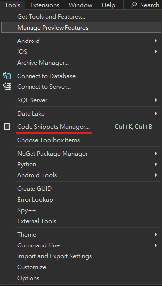
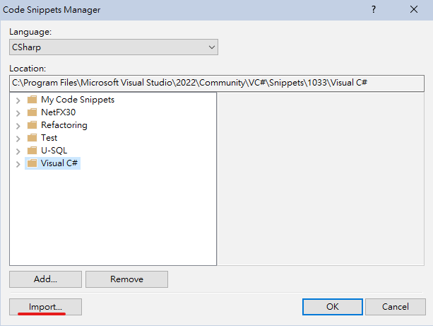
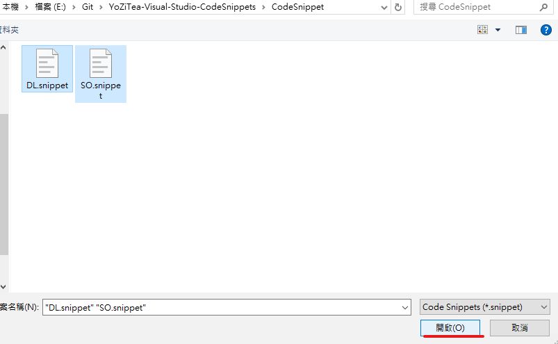
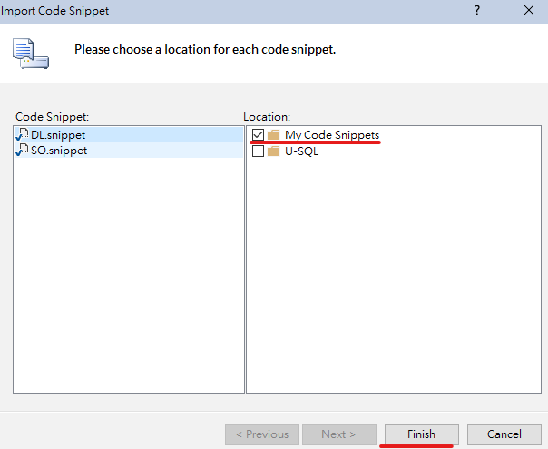

# YoZiTea VisualStudio CodeSnippets 柚子茶的VisualStudio程式碼片段
---
## 選單|
|[安裝方法](#安裝方法)|[目前快速鍵總覽](#目前快速鍵總覽)|
|:---:|:---|
## 安裝方法|

>點選 Code Snippets Manager

>點選Import

>並瀏覽到Clone到電腦磁盤中的資料夾中,找到並進入 **Code Snippets** 資料夾
>按Ctrl+A快速鍵來選中所有程式碼片段
>點選開放或者直接按鍵盤Enter鍵

>右邊可以選擇導入的資料夾
>點選Finish完成安裝

---

## 目前快速鍵總覽|

|快速鍵|目標程式碼片段|
|:---:|:---|
|dln|using UnityEngine; Debug.Log();|
|dlw|using UnityEngine; Debug.LogWarning();|
|dle|using UnityEngine; Debug.LogError();|
|so|using UnityEngine; [CreateAssetMenu(fileName = "so_", menuName = "menuname")] public class classname : ScriptableObject|
|rc|[RequireComponent(typeof(classname))]|
|uclass|public class ClassName : MonoBehaviour|
|csis|// csharpier-ignore|
|csim|// csharpier-ignore-start  // csharpier-ignore-end|